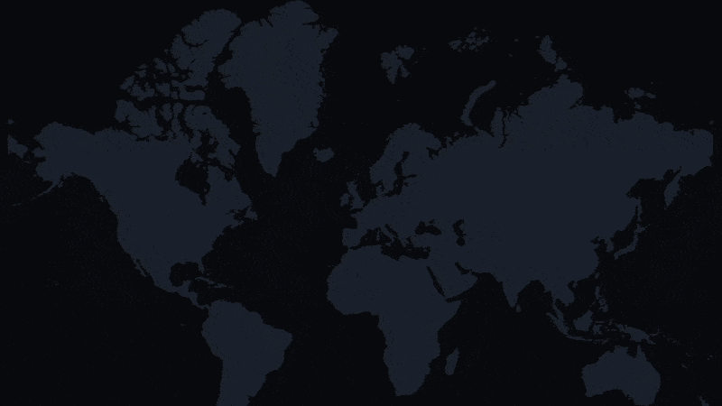

# Country Mogger

[](https://github.com/cijjas/country-mogger/actions/workflows/ci.yml)
[](LICENSE)

<p align="center">
  
</p>

Every week someone posts a map: "France's GDP fits inside Texas", "Africa is bigger than you think". Fun for exactly one screenshot. I love the genre too much to leave it there, so I built the toy those posts wish they were.

**Pick a country. Drop a pin anywhere on the map. Countries light up one by one until they add up to yours. Exactly.**

That is the whole app. It works for 24 metrics: area, GDP, population, military spending, homicides, tourists, CO₂, patents, science papers, electricity and more. The final country gets carved down to the exact fraction needed, so the total lands on 100%, not "roughly". Every number is World Bank data, and the exact indicator code is shown right in the UI.

Things it will tell you:

- The GDP of the United States equals **69 countries**: all of Europe, Russia, the Middle East, North Africa, and 9% of Sweden. That is the film above, and it is not a mockup, it is the app's real engine rendering its real output.
- Japan records about **285 homicides a year**. Brazil records about **40,700**.
- China emits almost **3x the CO₂** of the United States.

## Run it

```bash
npm install && npm run dev
```

Node 20.9+. No env vars, no accounts, no database. `npm test` runs the engine tests; `npm run build-data` refetches the World Bank snapshot.

## How the fill actually works

A greedy flood fill starts at the country under your pin and eats neighbours nearest-first through shared land borders. When a coastline runs out, it jumps the narrowest stretch of water, measured edge to edge, and keeps going. The country that would overshoot the budget is cut with an area-matched organic polygon cut (binary-searched boolean geometry, seam-aware for countries that cross the 180th meridian), so the outline you see is honest. Countries with no data for a metric are walked through but never counted. Results are memoised per seed country, which is why dragging the pin costs nothing. All of it is pure TypeScript in `lib/geo/`, unit-tested, no DOM.

## The demo film

The GIF is rendered with [Remotion](https://remotion.dev) from `demo/`, driving the app's actual fill engine and data. To re-render it: `cd demo && npm install && npm run render:gif`.

## Data

[World Bank Open Data](https://data.worldbank.org/) (CC BY 4.0), each country's latest value from 2015-2023, with per-capita rates converted to totals via population (`scripts/build-data.mjs`). Geometry from [Natural Earth](https://www.naturalearthdata.com/) via [world-atlas](https://github.com/topojson/world-atlas). Flags from [flagcdn](https://flagcdn.com/).

It is a toy for building intuition, not a citation source: snapshot years differ by country, and the partial cut matches its fraction by visual area.

---

MIT. Built with Next.js, D3, shadcn/ui and an unreasonable amount of computational geometry.
